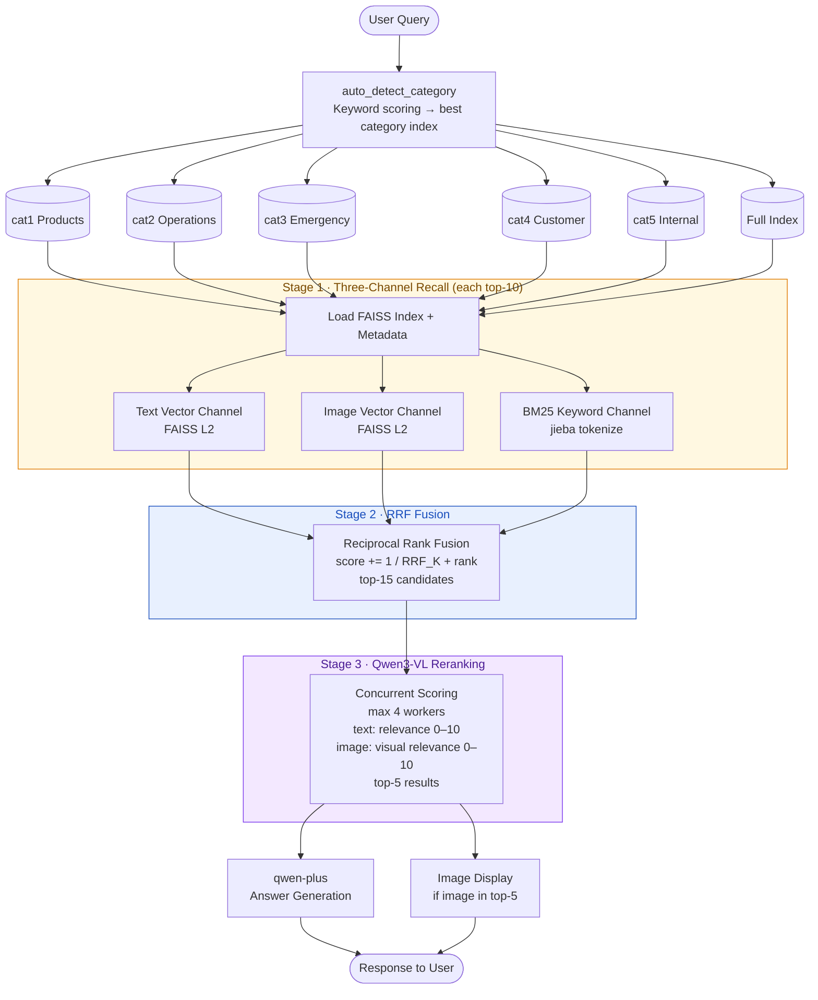

# Disney RAG Assistant · 迪士尼RAG助手

A multimodal RAG (Retrieval-Augmented Generation) chatbot for Disney park staff, built with Gradio and powered by Alibaba Cloud DashScope APIs. Answers questions about tickets, operations, emergency procedures, and more — with automatic image retrieval.

---

## Features

- **Hybrid retrieval** — Three independent channels (text vector, image vector, BM25 keyword) fused via Reciprocal Rank Fusion (RRF)
- **Multimodal** — Retrieves and displays relevant images (e.g. cruise price charts) alongside text answers
- **Qwen3-VL reranking** — Deep semantic reranking of top candidates using a vision-language model, running concurrently
- **Auto-routing** — Keyword scoring automatically selects the most relevant category index; falls back to full index when no match
- **5-category knowledge base** — 305 total vectors (296 text chunks + 9 images) across 5 Disney operational domains

---

## Architecture



---

## Tech Stack

| Component | Technology |
|-----------|-----------|
| Frontend | Gradio |
| Embedding | `qwen3-vl-embedding` (DashScope) |
| Vector DB | FAISS (`IndexFlatL2`) |
| Keyword Search | BM25 (`rank-bm25`) + jieba tokenization |
| Reranking | `qwen-vl-max` (DashScope) |
| Answer Generation | `qwen-plus` (DashScope, OpenAI-compatible) |
| Document Parsing | python-docx, PyMuPDF, python-pptx |

---

## Project Structure

```
├── 1-文本embedding.py            # Text embedding experiments
├── 2-图片embedding.py            # Image embedding experiments
├── 3-视频embedding.py            # Video embedding experiments
├── 4-disney_build_index.py       # Basic index builder (early prototype)
├── 5-disney_query.py             # Basic query script (early prototype)
├── 6-disney_app.py               # Main Gradio application
├── 7-disney_build_full_index.py  # Full index builder (all 5 categories)
├── 8-disney_rag_test.py          # Test suite
├── Disney_RAG_KnowledgeBase/     # Source documents (5 categories)
│   ├── 1-产品与服务详情/
│   ├── 2-运营流程与标准作业程序/
│   ├── 3-特殊情况与应急预案/
│   ├── 4-客户关系与支持话术/
│   └── 5-内部知识与工具/
├── disney_indexes/               # Generated FAISS indexes (6 index pairs)
│   ├── disney_full_index.faiss
│   ├── cat1_products_index.faiss
│   └── ...
└── requirements.txt
```

---

## Knowledge Base

| Category | Index | Text Chunks | Images |
|----------|-------|-------------|--------|
| 产品与服务详情 (Products & Services) | `cat1_products` | 164 | 9 |
| 运营流程与标准作业程序 (Operations) | `cat2_operations` | 30 | 0 |
| 特殊情况与应急预案 (Emergency) | `cat3_emergency` | 12 | 0 |
| 客户关系与支持话术 (Customer Relations) | `cat4_customer` | 7 | 0 |
| 内部知识与工具 (Internal Tools) | `cat5_internal` | 78 | 0 |
| **Full Index** | `disney_full` | **296** | **9** |

Supported source formats: `.docx`, `.doc`, `.pdf`, `.pptx`, and images (`.jpg`, `.jpeg`, `.png`, `.gif`, `.bmp`).

---

## Setup

### Prerequisites

- Python 3.10+
- A virtual environment (recommended)
- A [DashScope API key](https://dashscope.aliyun.com/)

### Install dependencies

```bash
python -m venv .venv
source .venv/bin/activate        # Windows: .venv\Scripts\activate
pip install -r requirements.txt
pip install gradio jieba rank-bm25
```

### Set environment variable

```bash
# Linux / macOS
export DASHSCOPE_API_KEY="your_api_key_here"

# Windows PowerShell
$env:DASHSCOPE_API_KEY = "your_api_key_here"
```

### Build the vector indexes

Place your source documents under `Disney_RAG_KnowledgeBase/` following the 5-category folder structure, then run:

```bash
python 7-disney_build_full_index.py
```

This generates 6 FAISS index pairs inside `disney_indexes/`.

### Run the app

```bash
python 6-disney_app.py
```

Open the Gradio URL printed in the terminal (default: `http://127.0.0.1:7860`).

---

## Running Tests

```bash
python 8-disney_rag_test.py
```

The test suite covers:
- Language detection and text splitting utilities
- jieba tokenizer behavior
- BM25 index construction and scoring
- FAISS index loading and metadata integrity (all 6 indexes)
- Retrieval quality — 20 grounded test cases across all 5 categories

---

## Key Configuration

Edit the constants at the top of `6-disney_app.py` to tune retrieval behavior:

```python
RETRIEVAL_TOP_K = 10   # candidates per channel (text / image / BM25)
RRF_K           = 60   # RRF constant — higher = smoother rank weighting
RRF_TOP_K       = 15   # candidates passed to reranker
RERANK_TOP_K    = 5    # final results after Qwen3-VL reranking
VL_RERANK_MODEL = "qwen-vl-max"           # reranking model
MULTIMODAL_EMBEDDING_MODEL = "qwen3-vl-embedding"  # embedding model
```

---

## Development Logs

- [2026-05-17](dev_log_2026-05-17.html) — Multi-category knowledge base integration and auto-routing
- [2026-05-20](dev_log_2026-05-20.html) — Hybrid retrieval architecture (BM25 + RRF + Qwen3-VL reranking) and embedding model upgrade
